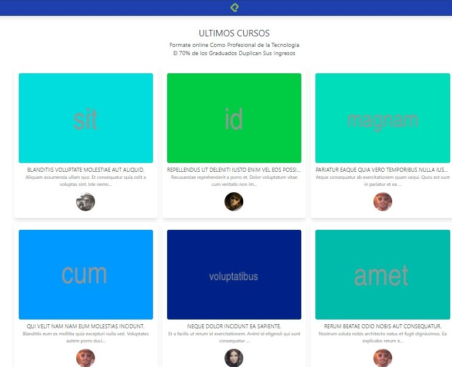

# Screenshot

<a href="https://www.linkedin.com/in/vilvasquez/">DESARROLLADO POR Vilvasquez</a>

## Hecho con  Laravel 8

Esta es una simple aplicacion creada como plataforma de educacion con sistema de login creado por livewire y jetstream ,se crea las funcionabilidades principales para una 
perfecta ejecucion de manejo  de cursos y  login de estudiantes.

##INSTALACION

Se importa la base de datos o se hace la ultima migracion del proyecto con make:migrate

